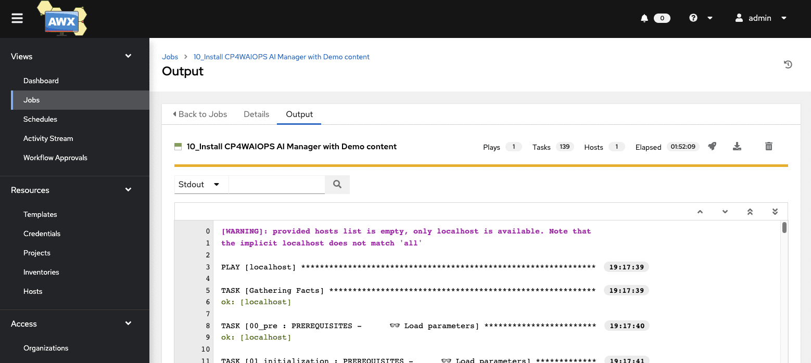
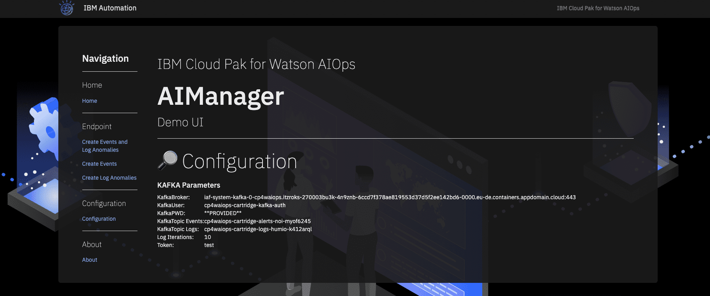
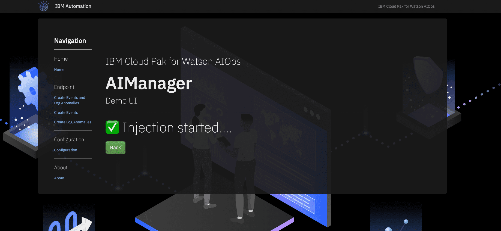
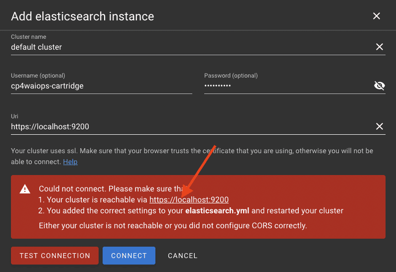
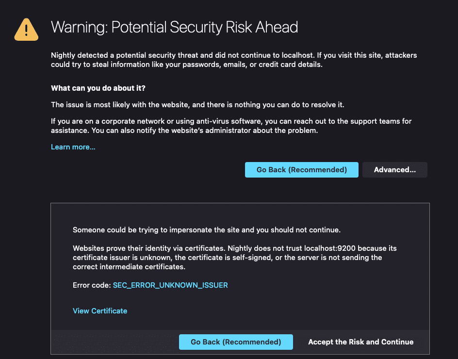
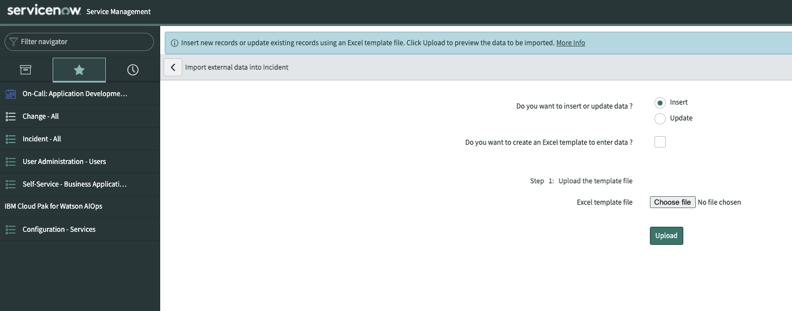

<center> <h1>CP4WatsonAIOps V3.3</h1> </center>
<center> <h2>Demo Environment Installation with Ansible Tower/AWX</h2> </center>


<center> ©2022 Niklaus Hirt / IBM </center>


<div style="page-break-after: always;"></div>


### ❗ THIS IS WORK IN PROGRESS
Please drop me a note on Slack or by mail nikh@ch.ibm.com if you find glitches or problems.


# Changes

| Date  | Description  | Files  | 
|---|---|---|
|  02.01.2022 | First Draft |  |

<div style="page-break-after: always;"></div>


---------------------------------------------------------------
# Installation
---------------------------------------------------------------

1. [Easy Install](#-1-easy-install)
1. [Provide Entitlement](#2-provide-entitlement)
1. [Installing Components](#3-installing-components)
	1. [Install AI Manager](#31-installing-ai-manager)
	1. [Install Event Manager](#32-installing-event-manager)
	1. [Installing Turbonomic](#33-installing-turbonomic)
	1. [Installing ELK](#34-installing-elk)
	1. [Installing Humio](#35-installing-humio)
	1. [Installing ServiceMest/Istio](#36-installing-servicemesh)
	1. [Installing AWX/AnsibleTower](#37-installing-awx)
	1. [Installing ManageIQ](#38-installing-manageiq
)
1. [AI Manager Configuration](#4-ai-manager-configuration)
1. [Event Manager Configuration](#5-event-manager-configuration)
1. [Runbook Configuration](#6-runbook-configuration)
1. [Demo the Solution](#7-demo-the-solution)
1. [Additional Configuration](#8-additional-configuration)
1. [Troubleshooting](#9-troubleshooting)
1. [Uninstall CP4WAIOPS](#10-uninstall)
1. [Service Now integration](#11-service-now-integration)
1. [Annex](#12-annex)


> ❗You can find a PDF version of this guide here: [PDF](./INSTALL_CP4WAIOPS.pdf).

<div style="page-break-after: always;"></div>


---------------------------------------------------------------
# 🚀 1 Easy Install
---------------------------------------------------------------

This installation method uses AWX (Open Source Ansible Tower) to install CP4WAIOPS and it's components.

## 1.1 Platform Install - AWX


Please create the following two elements in your OCP cluster.


### 1.1.1 Command Line install

You can run run:

```bash
oc apply -n default -f create-installer.yaml

or

kubectl apply -n default -f create-installer.yaml

```

<div style="page-break-after: always;"></div>

### 1.1.2 Web UI install

Or you can create them through the OCP Web UI:

```yaml
kind: ClusterRoleBinding
apiVersion: rbac.authorization.k8s.io/v1
metadata:
  name: installer-default-default
roleRef:
  apiGroup: rbac.authorization.k8s.io
  kind: ClusterRole
  name: cluster-admin
subjects:
  - kind: ServiceAccount
    name: default
    namespace: default
```

<div style="page-break-after: always;"></div>

```yaml
apiVersion: apps/v1
kind: Deployment
metadata:
  name: cp4waiops-installer
  namespace: default
  labels:
      app: cp4waiops-installer
spec:
  replicas: 1
  selector:
    matchLabels:
      app: cp4waiops-installer
  template:
    metadata:
      labels:
        app: cp4waiops-installer
    spec:
      containers:
      - image: niklaushirt/cp4waiops-installer:1.5
        imagePullPolicy: Always
        name: installer
        command:
        ports:
        - containerPort: 22
        resources:
          requests:
            cpu: "50m"
            memory: "50Mi"
          limits:
            cpu: "250m"
            memory: "250Mi"
        env:
          - name: INSTALL_REPO
            value : "https://github.com/niklaushirt/aiops-install-awx-33.git"
```

<div style="page-break-after: always;"></div>

---------------------------------------------------------------
# 2 Provide Entitlement
---------------------------------------------------------------

## 2.1 Get the CP4WAIOPS installation token

You can get the installation (pull) token from [https://myibm.ibm.com/products-services/containerlibrary](https://myibm.ibm.com/products-services/containerlibrary).

This allows the CP4WAIOPS images to be pulled from the IBM Container Registry.

<div style="page-break-after: always;"></div>


## 2.2 Enter the CP4WAIOPS installation token

1. Open the AWX instance
2. Select `Inventories`
3. Select `CP4WAIOPS Install`
	
4. Click Edit
5. Replace and uncomment the `ENTITLED_REGISTRY_KEY` 
	
6. Click Save


Yop are now ready to lauch the installations.

<div style="page-break-after: always;"></div>

---------------------------------------------------------------
# 3 Installing Components
---------------------------------------------------------------

The following Components can be installed:


| Category| Component  | Description  | 
|---|---|---|
| **CP4WAIOPS Base Install** |  |  |  
|| **10_InstallCP4WAIOPSAIManagerwithDemoContent** | Base AI Manager with RobotShop and LDAP integration | 
|| **11_InstallCP4WAIOPSAIEventManager** | Base Event Manager  |  
|| | |  
| **CP4WAIOPS Addons Install** |  | | 
|| 17_InstallCP4WAIOPSToolbox | Debugging Toolbox | 
|| 18_InstallCP4WAIOPSDemoUI | Demo UI to simulate incidents | 
|| | |  
| **Third-party** | | |  
|| 20_InstallTurbonomic | | 
|| 21_InstallHumio | | 
|| 22_InstallAWX | | 
|| 22_InstallELK | |  
|| 24_InstallManageIQ | | 
|| 29_InstallServiceMesh | |  
|| | |  
| **Topology** |  | |  
|| 80_Topology Load for AI Manager | Load the custom RobotShop Topology into AI Manager ASM | 
|| 81_Topology Load for Event Manager | Load the custom RobotShop Topology into Event Manager ASM | 
|| | | 
| **Training** |  | |  
|| 84_Train All Models | Create all training definitions (LAD, TemporalGrouping, Similar Incidents, Change Risk), loads the training data end runs the training | 
|| | | 
| **Tools** | | |  
|| 12_Get CP4WAIOPS Logins | Get Logins for all Components | 
|| 91_DebugPatch | Repatch some errors (non destructive) | 
|| 14_InstallRookCeph | |  


<div style="page-break-after: always;"></div>

## 3.1 Installing AI Manager 


### 3.1.1 Start AI Manager Installation 

1. Log into AWX
2. Click on `Templates`
1. Click on the Rocket 🚀 for entry `10_InstallCP4WAIOPSAIManagerwithDemoContent` to install a base `AI Manager` instance.
2. The Job will start with the installation

	

2. Wait until the Job has finished 

	

### 3.1.2 First Login 

After successful installation, the the URL and the Login Information for your first connections can be found in the Job execution Log.


You can also run `./tools/20_get_logins.sh` at any moment. This will print out all the relevant passwords and credentials (make sure your Terminal is logged into your Cluster).

Usually it's a good idea to store this in a file for later use:

```bash
./tools/20_get_logins.sh > my_credentials.txt
```

<div style="page-break-after: always;"></div>


### 3.1.3 Configure AI Manager 

There are some minimal configurations that you have to do to use the demo system and that are covered by the following flow:

###   🚀 Start here [Create Kubernetes Observer](#4-ai-manager-configuration)

Just click and follow the 🚀 and execute all the steps.

> ### Minimal Configuration
> 
> Those are the minimal configurations you'll need to demo the system and that are covered by the flow above.
> 
> **Configure Topology**
> 
> 1. Create Kubernetes Observer
> 1. Create REST Observer
> 1. Create Topology 🚀
> 1. Create AIOps Application
> 
> **Models Training**
> 
> 1. Train the Models 🚀
> 1. Create Integrations
> 
> **Configure Slack**
> 
> 1. Setup Slack
> 1. Adapt Web Certificates
> 
> **Configure Logins**
> 
> 1. Configure LDAP Logins


<div style="page-break-after: always;"></div>


## 3.2 Installing Event Manager 


### 3.2.1 Start Event Manager Installation 

1. Log into AWX
2. Click on `Templates`
1. Click on the Rocket 🚀 for entry `11_Install CP4WAIOPS AI Event Manager` to install a base `Event Manager` instance.
2. The Job will start with the installation
2. Wait until the Job has finished 


### 3.2.2 First Login 

After successful installation, the the URL and the Login Information for your first connections can be found in the Job execution Log.


You can also run `./tools/20_get_logins.sh` at any moment. This will print out all the relevant passwords and credentials (make sure your Terminal is logged into your Cluster).

Usually it's a good idea to store this in a file for later use:

```bash
./tools/20_get_logins.sh > my_credentials.txt
```

<div style="page-break-after: always;"></div>


### 3.2.3 Configure Event Manager 

There are some minimal configurations that you have to do to use the demo system and that are covered by the following flow:

###   🚀 Start here [Create Kubernetes Observer](#51-create-kubernetes-observer-for-event-manager)


Just click and follow the 🚀 and execute all the steps.

> ### Minimal Configuration
> 
> Those are the minimal configurations you'll need to demo the system and that are covered by the flow above.
> 
> **Configure Topology**
> 
> 1. Create Kubernetes Observer
> 1. Create REST Observer
> 1. Create Topology (🚀 - Option 51)
> 
> **Configure Integrations**
> 
> 1. EventManager Webhook 
> 
>  **Configure Customization**
> 
> 1. Create custom Filter 
> 1. Create custom View 
> 1. Create grouping Policy 
> 1. Create EventManager/NOI Menu item - Open URL 


<div style="page-break-after: always;"></div>

## 3.3 Installing Turbonomic 

1. Log into AWX
2. Click on `Templates`
1. Click on the Rocket 🚀 for entry `20_Install Turbonomic` to install a base `Turbonomic` instance.
2. The Job will start with the installation
2. Wait until the Job has finished 


## 3.4 Installing ELK 

1. Log into AWX
2. Click on `Templates`
1. Click on the Rocket 🚀 for entry `22_Install ELK` to install a base `ELK` instance.
2. The Job will start with the installation
2. Wait until the Job has finished 


## 3.5 Installing Humio 

1. Log into AWX
2. Click on `Templates`
1. Click on the Rocket 🚀 for entry `21_Install Humio` to install a base `Humio` instance.
2. The Job will start with the installation
2. Wait until the Job has finished 


## 3.6 Installing ServiceMesh 

1. Log into AWX
2. Click on `Templates`
1. Click on the Rocket 🚀 for entry `11_Install CP4WAIOPS AI Event Manager` to install a base `ServiceMesh` instance.
2. The Job will start with the installation
2. Wait until the Job has finished 

<div style="page-break-after: always;"></div>

## 3.7 Installing AWX 

1. Log into AWX
2. Click on `Templates`
1. Click on the Rocket 🚀 for entry `29_Install ServiceMesh` to install a base `AWX` instance.
2. The Job will start with the installation
2. Wait until the Job has finished 

## 3.8 Installing ManageIQ 

1. Log into AWX
2. Click on `Templates`
1. Click on the Rocket 🚀 for entry `24_Install ManageIQ` to install a base `ManageIQ` instance.
2. The Job will start with the installation
2. Wait until the Job has finished 

<div style="page-break-after: always;"></div>

---------------------------------------------------------------
# 4 AI Manager Configuration
---------------------------------------------------------------


## 4.1 Configure Applications and Topology

### 4.1.1 Create Kubernetes Observer for the Demo Applications 

Do this for your applications (RobotShop by default)

* In the `AI Manager` "Hamburger" Menu select `Operate`/`Data and tool integrations`
* Click `Add connection`
* Under `Kubernetes`, click on `Add Integration`
* Click `Connect`
* Name it `RobotShop`
* Data Center `demo`
* Click `Next`
* Choose `local` for Connection Type
* Set `Hide pods that have been terminated` to `On`
* Set `Correlate analytics events on the namespace groups created by this job` to `On`
* Set Namespace to `robot-shop`
* Click `Next`
* Click `Done`


### 4.1.2 Create REST Observer to Load Topologies 

* In the `AI Manager` "Hamburger" Menu select `Operate`/`Data and tool integrations`
* Click `Add connection`
* On the left click on `Topology`
* On the top right click on `You can also configure, schedule, and manage other observer jobs` 
* Click on  `Add a new Job`
* Select `REST`/ `Configure`
* Choose “bulk_replace”
* Set Unique ID to “listenJob” (important!)
* Set Provider to whatever you like (usually I set it to “listenJob” as well)
* `Save`


<div style="page-break-after: always;"></div>

### 4.1.3 🚀 Create Topology 

1. Log into AWX
2. Click on `Templates`
1. Click on the Rocket 🚀 for entry `80_Topology Load` to install a base `AI Manager` instance.

❗ Please manually re-run the Kubernetes Observer to make sure that the merge has been done.

### 4.1.4 Create AIOps Application 

#### Robotshop

* In the `AI Manager` go into `Operate` / `Application Management` 
* Click `Define Application`
* Select `robot-shop` namespace
* Click `Next`
* Click `Next`
* Name your Application (RobotShop)
* If you like check `Mark as favorite`
* Click `Define Application`


<div style="page-break-after: always;"></div>

## 4.2 Train the Models

### 4.2.1 🚀 Training 


1. Log into AWX
2. Click on `Templates`
1. Click on the Rocket 🚀 for entry `84_Training All Models` to install a base `AI Manager` instance.
2. This will automatically:
	- Load the training data
	- Create the training definitions
	- Launch the trainings

This will be done for:

- Log Anomaly Detection (Logs)
- Temporal Grouping (Events)
- Similar Incidents (Service Now)
- Change Risk (Service Now)


<div style="page-break-after: always;"></div>

### 4.2.2 Create Integrations 

#### 4.2.2.1 Create Kafka Humio Log Training Integration 

* In the `AI Manager` "Hamburger" Menu select `Define`/`Data and tool integrations`
* Click `Add connection`
* Under `Kafka`, click on `Add Integration`
* Click `Connect`
* Name it `HumioInject`
* Click `Next`
* Select `Data Source` / `Logs`
* Select `Mapping Type` / `Humio`
* Paste the following in `Mapping` (the default is **incorrect**!:

	```json
	{
	"codec": "humio",
	"message_field": "@rawstring",
	"log_entity_types": "kubernetes.namespace_name,kubernetes.container_hash,kubernetes.host,kubernetes.container_name,kubernetes.pod_name",
	"instance_id_field": "kubernetes.container_name",
	"rolling_time": 10,
	"timestamp_field": "@timestamp"
	}
	```
* Click `Next`
* Toggle `Data Flow` to the `ON` position
* Select `Live data for continuous AI training and anomaly detection`
* Click `Save`


<div style="page-break-after: always;"></div>

#### 4.2.2.2 Create Kafka Netcool Training Integration 

* In the `AI Manager` "Hamburger" Menu select `Operate`/`Data and tool integrations`
* Click `Add connection`
* Under `Kafka`, click on `Add Integration`
* Click `Connect`
* Name it `EvetnManager`
* Click `Next`
* Select `Data Source` / `Events`
* Select `Mapping Type` / `NOI`
* Click `Next`
* Toggle `Data Flow` to the `ON` position
* Click `Save`


<div style="page-break-after: always;"></div>


### 4.3 Slack integration


### 4.3.1 Initial Slack Setup 

For the system to work you need to setup your own secure gateway and slack workspace. It is suggested that you do this within the public slack so that you can invite the customer to the experience as well. It also makes it easier for is to release this image to Business partners

You will need to create your own workspace to connect to your instance of CP4WAOps.

Here are the steps to follow:

1. [Create Slack Workspace](./doc/slack/1_slack_workspace.md)
1. [Create Slack App](./doc/slack/2_slack_app_create.md)
1. [Create Slack Channels](./doc/slack/3_slack_channel.md)
1. [Create Slack Integration](./doc/slack/4_slack_integrate.md)
1. [Get the Integration URL - Public Cloud - ROKS](./doc/slack/5_slack_url_public.md) OR 
1. [Get the Integration URL - Private Cloud - Fyre/TEC](./doc/slack/5_slack_url_private.md)
1. [Create Slack App Communications](./doc/slack/6_slack_app_integration.md)
1. [Prepare Slack Reset](./doc/slack/7_slack_reset.md)


<div style="page-break-after: always;"></div>

### 4.3.2 Create valid CP4WAIOPS Certificate 


In order for Slack integration to work, there must be a signed certicate on the NGNIX pods. The default certificate is self-signed and Slack will not accept that. The method for updating the certificate has changed between AIOps v2.1 and V3.1.1. The NGNIX pods in V3.1.1 mount the certificate through a secret called `external-tls-secret` and that takes precedent over the certificates staged under `/user-home/_global_/customer-certs/`.

For customer deployments, it is required for the customer to provide their own signed certificates. An easy workaround for this is to use the Openshift certificate when deploying on ROKS. **Caveat**: The CA signed certificate used by Openshift is automatically cycled by ROKS (I think every 90 days), so you will need to repeat the below once the existing certificate is expired and possibly reconfigure Slack.


This method replaces the existing secret/certificate with the one that OpenShift ingress uses, not altering the NGINX deployment. An important note, these instructions are for configuring the certificate post-install. Best practice is to follow the installation instructions for configuring certificates during that time.

<div style="page-break-after: always;"></div>

### 4.3.2.1 Patch AutomationUIConfig

The custom resource `AutomationUIConfig/iaf-system` controls the certificates and the NGINX pods that use those certificates. Any direct update to the certificates or pods will eventually get overwritten, unless you first reconfigure `iaf-system`. It's a bit tricky post-install as you will have to recreate the `iaf-system` resource quickly after deleting it, or else the installation operator will recreate it. For this reason it's important to run all the commands one after the other. **Ensure that you are in the project for AIOps**, then paste all the code on your command line to replace the `iaf-system` resource.

```bash
NAMESPACE=$(oc project -q)
IAF_STORAGE=$(oc get AutomationUIConfig -n $NAMESPACE -o jsonpath='{ .items[*].spec.storage.class }')
oc get -n $NAMESPACE AutomationUIConfig iaf-system -oyaml > iaf-system-backup.yaml
oc delete -n $NAMESPACE AutomationUIConfig iaf-system
cat <<EOF | oc apply -f -
apiVersion: core.automation.ibm.com/v1beta1
kind: AutomationUIConfig
metadata:
  name: iaf-system
  namespace: $NAMESPACE
spec:
  description: AutomationUIConfig for cp4waiops
  license:
    accept: true
  version: v1.0
  storage:
    class: $IAF_STORAGE
  tls:
    caSecret:
      key: ca.crt
      secretName: external-tls-secret
    certificateSecret:
      secretName: external-tls-secret
EOF
```

<div style="page-break-after: always;"></div>

#### 4.3.2.2 NGNIX Certificate

Again, **ensure that you are in the project for AIOps** and run the following to replace the existing secret with a secret containing the OpenShift ingress certificate.

```bash
WAIOPS_NAMESPACE =$(oc project -q)
# collect certificate from OpenShift ingress
ingress_pod=$(oc get secrets -n openshift-ingress | grep tls | grep -v router-metrics-certs-default | awk '{print $1}')
oc get secret -n openshift-ingress -o 'go-template={{index .data "tls.crt"}}' ${ingress_pod} | base64 -d > cert.crt
oc get secret -n openshift-ingress -o 'go-template={{index .data "tls.key"}}' ${ingress_pod} | base64 -d > cert.key
oc get secret -n $WAIOPS_NAMESPACE iaf-system-automationui-aui-zen-ca -o 'go-template={{index .data "ca.crt"}}'| base64 -d > ca.crt
# backup existing secret
oc get secret -n $WAIOPS_NAMESPACE external-tls-secret -o yaml > external-tls-secret$(date +%Y-%m-%dT%H:%M:%S).yaml
# delete existing secret
oc delete secret -n $WAIOPS_NAMESPACE external-tls-secret
# create new secret
oc create secret generic -n $WAIOPS_NAMESPACE external-tls-secret --from-file=ca.crt=ca.crt --from-file=cert.crt=cert.crt --from-file=cert.key=cert.key --dry-run=client -o yaml | oc apply -f -
#oc create secret generic -n $WAIOPS_NAMESPACE external-tls-secret --from-file=cert.crt=cert.crt --from-file=cert.key=cert.key --dry-run=client -o yaml | oc apply -f -
# scale down nginx
REPLICAS=2
oc scale Deployment/ibm-nginx --replicas=0
# scale up nginx
sleep 3
oc scale Deployment/ibm-nginx --replicas=${REPLICAS}
rm external-tls-secret
```


Wait for the nginx pods to come back up

```bash
oc get pods -l component=ibm-nginx
```

When the integration is running, remove the backup file

```bash
rm ./iaf-system-backup.yaml
```

And then restart the Slack integration Pod

```bash
oc delete pod $(oc get po -n $WAIOPS_NAMESPACE|grep slack|awk '{print$1}') -n $WAIOPS_NAMESPACE --grace-period 0 --force
```

The last few lines scales down the NGINX pods and scales them back up. It takes about 3 minutes for the pods to fully come back up.

Once those pods have come back up, you can verify the certificate is secure by logging in to AIOps. Note that the login page is not part of AIOps, but rather part of Foundational Services. So you will have to login first and then check that the certificate is valid once logged in. If you want to update the certicate for Foundational Services you can find instructions [here](https://www.ibm.com/docs/en/cpfs?topic=operator-replacing-foundational-services-endpoint-certificates).

<div style="page-break-after: always;"></div>

---------------------------------------------------------------
## 4.4 Some Polishing
---------------------------------------------------------------

### 4.4.1 Add LDAP Logins to CP4WAIOPS 


* Go to `AI Manager` Dashboard
* Click on the top left "Hamburger" menu
* Select `User Management`
* Select `User Groups` Tab
* Click `New User Group`
* Enter demo (or whatever you like)
* Click Next
* Select `LDAP Groups`
* Search for `demo`
* Select `cn=demo,ou=Groups,dc=ibm,dc=com`
* Click Next
* Select Roles (I use Administrator for the demo environment)
* Click Next
* Click Create
* 


<div style="page-break-after: always;"></div>

---------------------------------------------------------------
# 5 Event Manager Configuration
---------------------------------------------------------------

❗ You only have to do this if you have installed EventManager/NOI (As described in Easy Install - Chapter 6). For basic demoing with AI MAnager this is not needed.


## 5.1 Create Kubernetes Observer for Event Manager 

This is basically the same as for AI Manager as we need two separate instances of the Topology Manager. 


* In the `Event Manager` "Hamburger" Menu select `Administration`/`Topology Management`
* Under `Observer jobs` click `Configure`
* Click `Add new job`
* Under `Kubernetes`, click on `Configure`
* Choose `local` for `Connection Type`
* Set `Unique ID` to `robot-shop`
* Set `data_center` to `robot-shop`
* Under `Additional Parameters`
* Set `Terminated pods` to `true`
* Set `Correlate` to `true`
* Set Namespace to `robot-shop`
* Under `Job Schedule`
* Set `Time Interval` to 5 Minutes
* Click `Save`


## 5.2 Create REST Observer to Load Topologies 

* In the `Event Manager` "Hamburger" Menu select `Administration`/`Topology Management`
* Under `Observer jobs` click `Configure`
* Click `Add new job`
* Under `REST`, click on `Configure`
* Choose `bulk_replace` for `Job Type`
* Set `Unique ID` to `listenJob` (important!)
* Set `Provider` to `listenJob` 
* Click `Save`


<div style="page-break-after: always;"></div>

## 5.3 🚀 Create Topology 

1. Log into AWX
2. Click on `Templates`
1. Click on the Rocket 🚀 for entry `81_Topology Load for Event Manager` to install a base `AI Manager` instance.

❗ Please manually re-run the Kubernetes Observer to make sure that the merge has been done.


## 5.4 EventManager Webhook 

Create Webhooks in EventManager for Event injection and incident simulation for the Demo.

The demo scripts (in the `demo` folder) give you the possibility to simulate an outage without relying on the integrations with other systems.

At this time it simulates:

- Git push event
- Log Events (Humio)
- Security Events (Falco)
- Instana Events
- Metric Manager Events (Predictive)
- Turbonomic Events
- CP4MCM Synthetic Selenium Test Events


<div style="page-break-after: always;"></div>


You have to define the following Webhook in EventManager (NOI): 

* `Administration` / `Integration with other Systems`
* `Incoming` / `New Integration`
* `Webhook`
* Name it `Demo Generic`
* Jot down the WebHook URL and copy it to the `NETCOOL_WEBHOOK_GENERIC` in the `./tools/01_demo/incident_robotshop-noi.sh`file
* Click on `Optional event attributes`
* Scroll down and click on the + sign for `URL`
* Click `Confirm Selections`


Use this json:

```json
{
  "timestamp": "1619706828000",
  "severity": "Critical",
  "summary": "Test Event",
  "nodename": "productpage-v1",
  "alertgroup": "robotshop",
  "url": "https://pirsoscom.github.io/grafana-robotshop.html"
}
```

Fill out the following fields and save:

* Severity: `severity`
* Summary: `summary`
* Resource name: `nodename`
* Event type: `alertgroup`
* Url: `url`
* Description: `"URL"`

Optionnally you can also add `Expiry Time` from `Optional event attributes` and set it to a convenient number of seconds (just make sure that you have time to run the demo before they expire.

<div style="page-break-after: always;"></div>

## 5.5 Create custom Filter and View in EventManager 

### 5.5.1 Filter 

Duplicate the `Default` filter and set to global.

* Name: AIOPS
* Logic: **Any** (!)
* Filter:
	* AlertGroup = 'CEACorrelationKeyParent'
	* AlertGroup = 'robot-shop'

#### 11.1.5.2 View 

Duplicate the `Example_IBM_CloudAnalytics` View and set to global.


* Name: AIOPS

Configure to your likings.


## 5.6 Create grouping Policy 

* NetCool Web Gui --> `Insights` / `Scope Based Grouping`
* Click `Create Policy`
* `Action` select fielt `Alert Group`
* Toggle `Enabled` to `On`
* Save

<div style="page-break-after: always;"></div>

## 5.7 Create EventManager/NOI Menu item - Open URL 

in the Netcool WebGUI

* Go to `Administration` / `Tool Configuration`
* Click on `LaunchRunbook`
* Copy it (the middle button with the two sheets)
* Name it `Launch URL`
* Replace the Script Command with the following code

	```javascript
	var urlId = '{$selected_rows.URL}';
	
	if (urlId == '') {
	    alert('This event is not linked to an URL');
	} else {
	    var wnd = window.open(urlId, '_blank');
	}
	```
* Save

Then 

* Go to `Administration` / `Menu Configuration`
* Select `alerts`
* Click on `Modify`
* Move Launch URL to the right column
* Save

<div style="page-break-after: always;"></div>


---------------------------------------------------------------
# 6 Runbook Configuration
---------------------------------------------------------------


## 6.1 Configure AWX 

There is some demo content available to RobotShop.

1. Log in to AWX
2. Add a new Project
	1. Name it `DemoCP4WAIOPS`
	1. Source Control Credential Type to `Git`
	1. Set source control URL to `https://github.com/niklaushirt/ansible-demo`
	2. Save
	
1. Add new Job Template
	1. Name it `Mitigate Robotshop Ratings Outage`
	2. Select Inventory `Demo Inventory`
	3. Select Project `DemoCP4WAIOPS`
	4. Select Playbook `cp4waiops/robotshop-restart/start-ratings.yaml`
	5. Select` Prompt on launch` for `Variables`  ❗
	2. Save


## 6.2 Configure AWX Integration 

In EventManager:

1. Select `Administration` / `Integration with other Systems`
1. Select `Automation type` tab
1. For `Ansible Tower` click  `Configure`
2. Enter the URL and credentials for your AWX instance (you can use the defautl `admin` user)
3. Click Save

<div style="page-break-after: always;"></div>

## 6.3 Configure Runbook 

In EventManager:

1. Select `Automations` / `Runbooks`
1. Select `Library` tab
1. Click  `New Runbook`
1. Name it `Mitigate Robotshop Ratings Outage`
1. Click `Add automated Step`
2. Select the `Mitigate Robotshop Ratings Outage` Job
3. Click `Select this automation`
4. Select `New Runbook Parameter`
5. Name it `ClusterCredentials`
6. Input the login credentials in JSON Format (get the URL and token from the 20_get_logins.sh script)

	```json
	{     
		"my_k8s_apiurl": "https://c117-e.xyz.containers.cloud.ibm.com:12345",
		"my_k8s_apikey": "PASTE YOUR API KEY"
	}
	```
7. Click Save
7. Click Publish


Now you can test the Runbook by clicking on `Run`.

<div style="page-break-after: always;"></div>

## 6.4 Add Runbook Triggers 

1. Select `Automations` / `Runbooks`
1. Select `Triggers` tab
1. Click  `New Trigger `
1. Name it `Mitigate Robotshop Ratings Outage`
1. Add conditions:
   * Conditions
	* Name: RobotShop
	* Attribute: Node
	* Operator: Equals
	* Value: mysql-instana or mysql-predictive
1. Click `Run Test`
2. You should get an Event `[Instana] Robotshop available replicas is less than desired replicas - Check conditions and error events - ratings`
3. Select `Mitigate RobotShop Problem`
4. Click `Select This Runbook`
5. Toggle `Execution` / `Automatic` to `off`
6. Click `Save`


<div style="page-break-after: always;"></div>


---------------------------------------------------------------
# 7 Demo the Solution
---------------------------------------------------------------

## 7.1 Simulate incident - Demo UI

> ❗**In order to use the DEMO UI, you have to have followed through all the steps in [AI Manager Configuration](#4-ai-manager-configuration). Notably Configuring Topology, Integrations and having run the Models Training.**

### 7.1.1 Install Demo UI

1. Log into AWX
2. Click on `Templates`
1. Click on the Rocket 🚀 for entry `18_Install CP4WAIOPS Demo UI` to install the `Demo UI` instance.
2. The Job will start with the installation
2. Wait until the Job has finished 

## 7.1.2 Simulate incident - Demo UI

1. Run `./tools/20_get_logins.sh` to get the URL and Login Token.
1. Open the URL and enter the Token.
	
1. Click on Configuration
1. Verify that you have `Kafka Topics` shown for Events and Logs
	
1. Click `Back`
1. Now you can use the buttons to simulate:

	* Only Events
	* Only Log Anomalies
	* or Both
	

1. The UI will confirm that the incident creation has been launched
	


## 7.2 Simulate incident - Command Line

**Make sure you are logged-in to the Kubernetes Cluster first** 

In the terminal type 

```bash
./tools/01_demo/incident_robotshop.sh
```

This will delete all existing Alerts and inject pre-canned event and logs to create a story.

ℹ️  Give it a minute or two for all events and anomalies to arrive in Slack.


<div style="page-break-after: always;"></div>


---------------------------------------------------------------
# 8 Additional Configuration
---------------------------------------------------------------

## 8.1 Setup remote Kubernetes Observer


### 8.1.1. Get Kubernetes Cluster Access Details

As part of the kubernetes observer, it is required to communicate with the target cluster. So it is required to have the URL and Access token details of the target cluster. 

Do the following.


#### 8.1.1.1. Login

Login into the remote Kubernetes cluster on the Command Line.

#### 8.1.1.2. Access user/token 


Run the following:

```
./tools/97_addons/k8s-remote/remote_user.sh
```

This will create the remote user if it does not exist and print the access token (also if you have already created).

Please jot this down.


### 8.1.1. Create Kubernetes Observer Connection


* In the `AI Manager` "Hamburger" Menu select `Operate`/`Data and tool integrations`
* Click `Add connection`
* Under `Kubernetes`, click on `Add Integration`
* Click `Connect`
* Name it `RobotShop`
* Data Center `demo`
* Click `Next`
* Choose `Load` for Connection Type
* Input the URL you have gotten from the step above in `Kubernetes master IP address` (without the https://)
* Input the port for the URL you have gotten from the step above in `Kubernetes API port`
* Input the `Token` you have gotten from the step above
* Set `Trust all certificates by bypassing certificate verification` to `On`
* Set `Hide pods that have been terminated` to `On`
* Set `Correlate analytics events on the namespace groups created by this job` to `On`
* Set Namespace to `robot-shop`
* Click `Next`
* Click `Done`


<div style="page-break-after: always;"></div>


---------------------------------------------------------------

# 9. TROUBLESHOOTING
---------------------------------------------------------------


## 9.1 Mitigation Job

1. Log into AWX
2. Click on `Templates`
1. Click on the Rocket 🚀 for entry `91_Debug Patch`
2. The Job will start applying all the known workarounds to get the instance up and running
2. Wait until the Job has finished 


## 9.2 Check with script

❗ There is a new script that can help you automate some common problems in your CP4WAIOPS installation.

Just run:

```
./tools/10_debug_install.sh
```

and select `Option 1`


## 9.3 Pods in Crashloop

If the evtmanager-topology-merge and/or evtmanager-ibm-hdm-analytics-dev-inferenceservice are crashlooping, apply the following patches. I have only seen this happen on ROKS.

```bash
export WAIOPS_NAMESPACE=cp4waiops

oc patch deployment evtmanager-topology-merge -n $WAIOPS_NAMESPACE --patch-file ./yaml/waiops/pazch/topology-merge-patch.yaml


oc patch deployment evtmanager-ibm-hdm-analytics-dev-inferenceservice -n $WAIOPS_NAMESPACE --patch-file ./yaml/waiops/patch/evtmanager-inferenceservice-patch.yaml
```


<div style="page-break-after: always;"></div>

## 9.4 Pods with Pull Error

If the ir-analytics or cassandra job pods are having pull errors, apply the following patches. 

```bash
export WAIOPS_NAMESPACE=cp4waiops

kubectl patch -n $WAIOPS_NAMESPACE serviceaccount aiops-topology-service-account -p '{"imagePullSecrets": [{"name": "ibm-entitlement-key"}]}'
kubectl patch -n $WAIOPS_NAMESPACE serviceaccount aiops-ir-analytics-spark-worker -p '{"imagePullSecrets": [{"name": "ibm-entitlement-key"}]}'
kubectl patch -n $WAIOPS_NAMESPACE serviceaccount aiops-ir-analytics-spark-pipeline-composer -p '{"imagePullSecrets": [{"name": "ibm-entitlement-key"}]}'
kubectl patch -n $WAIOPS_NAMESPACE serviceaccount aiops-ir-analytics-spark-master -p '{"imagePullSecrets": [{"name": "ibm-entitlement-key"}]}'
kubectl patch -n $WAIOPS_NAMESPACE serviceaccount aiops-ir-analytics-probablecause -p '{"imagePullSecrets": [{"name": "ibm-entitlement-key"}]}'
kubectl patch -n $WAIOPS_NAMESPACE serviceaccount aiops-ir-analytics-classifier -p '{"imagePullSecrets": [{"name": "ibm-entitlement-key"}]}'
kubectl patch -n $WAIOPS_NAMESPACE serviceaccount aiops-ir-lifecycle-eventprocessor-ep -p '{"imagePullSecrets": [{"name": "ibm-entitlement-key"}]}'
oc delete pod $(oc get po -n $WAIOPS_NAMESPACE|grep ImagePull|awk '{print$1}') -n $WAIOPS_NAMESPACE


```


## 9.5 Camel-K Handlers Error

If the scm-handler or snow-handler pods are not coming up, apply the following patches. 

```bash
export WAIOPS_NAMESPACE=cp4waiops

oc patch vaultaccess/ibm-vault-access -p '{"spec":{"token_period":"760h"}}' --type=merge -n $WAIOPS_NAMESPACE
oc delete pod $(oc get po -n $WAIOPS_NAMESPACE|grep 0/| grep -v "Completed"|awk '{print$1}') -n $WAIOPS_NAMESPACE

```


## 9.6 Slack integration not working

See [here](#432-create-valid-cp4waiops-certificate)

<div style="page-break-after: always;"></div>


## 9.7 Check if data is flowing

### 9.7.1 Check Log injection

To check if logs are being injected through the demo script:

1. Launch 

	```bash
	./tools/22_monitor_kafka.sh
	```
2. Select option 4

You should see data coming in.

### 9.7.2 Check Events injection

To check if events are being injected through the demo script:

1. Launch 

	```bash
	./tools/22_monitor_kafka.sh
	```
2. Select option 3

You should see data coming in.

### 9.7.3 Check Stories being generated

To check if stories are being generated:

1. Launch 

	```bash
	./tools/22_monitor_kafka.sh
	```
2. Select option 2

You should see data being generated.

<div style="page-break-after: always;"></div>

## 9.8 Docker Pull secret

####  ❗⚠️ Make a copy of the secret before modifying 
####  ❗⚠️ On ROKS (any version) and before 4.7 you have to restart the worker nodes after the modification  

We learnt this the hard way...

```bash
oc get secret -n openshift-config pull-secret -oyaml > pull-secret_backup.yaml
```

or more elegant

```bash
oc get Secret -n openshift-config pull-secret -ojson | jq 'del(.metadata.annotations, .metadata.creationTimestamp, .metadata.generation, .metadata.managedFields, .metadata.resourceVersion , .metadata.selfLink , .metadata.uid, .status)' > pull-secret_backup.json
```

In order to avoid errors with Docker Registry pull rate limits, you should add your Docker credentials to the Cluster.
This can occur especially with Rook/Ceph installation.

* Go to Secrets in Namespace `openshift-config`
* Open the `pull-secret`Secret
* Select `Actions`/`Edit Secret` 
* Scroll down and click `Add Credentials`
* Enter your Docker credentials

	

* Click Save

If you already have Pods in ImagePullBackoff state then just delete them. They will recreate and should pull the image correctly.


<div style="page-break-after: always;"></div>

## 9.9 Monitor ElasticSearch Indexes

At any moment you can run `./tools/28_access_elastic.sh` in a separate terminal window.

This allows you to access ElasticSearch and gives you:

* ES User
* ES Password

	
	

### 9.9.1 Monitor ElasticSearch Indexes from Firefox

I use the [Elasticvue](https://addons.mozilla.org/en-US/firefox/addon/elasticvue/) Firefox plugin.

Follow these steps to connects from Elasticvue:

- Select `Add Cluster` 
	

<div style="page-break-after: always;"></div>

- Put in the credentials and make sure you put `https` and not `http` in the URL
	
- Click `Test Connection` - you will get an error
- Click on the `https://localhost:9200` URL
	
	
<div style="page-break-after: always;"></div>

- This will open a new Tab, select `Accept Risk and Continue` 
	
- Cancel the login screen and go back to the previous tab
- Click `Connect` 
- You should now be connected to your AI Manager ElasticSearch instance 
	

<div style="page-break-after: always;"></div>

---------------------------------------------------------------
# 10. Uninstall
---------------------------------------------------------------

❗ The scritps are coming from here [https://github.com/IBM/cp4waiops-samples.git](https://github.com/IBM/cp4waiops-samples.git)

If you run into problems check back if there have been some updates.


I have tested those on 3.1.1 as well and it seemed to work (was able to do a complete reinstall afterwards).

Just run:

```
./tools/99_uninstall/3.2/uninstall-cp4waiops.props
```


<div style="page-break-after: always;"></div>

---------------------------------------------------------------
# 11 Service Now integration
---------------------------------------------------------------


## 11.1 Integration 

1. Follow [this](./doc/servicenow/snow-Integrate.md) document to get and configure your Service Now Dev instance with CP4WAIOPS.
	Stop at `Testing the ServiceNow Integration`. 
	❗❗Don’t do the training as of yet.
2. Import the Changes from ./doc/servicenow/import_change.xlsx
	1. Select `Change - All` from the right-hand menu
	2. Right Click on `Number`in the header column
	3. Select Import
	
	3. Chose the ./doc/servicenow/import_change.xlsx file and click `Upload`
	
	3. Click on `Preview Imported Data`
	
	3. Click on `Complete Import` (if there are errors or warnings just ignore them and import anyway)
	
	
3. Import the Incidents from ./doc/servicenow/import_incidents.xlsx
	1. Select `Incidents - All` from the right-hand menu
	2. Proceed as for the Changes but for Incidents
	
4. Now you can finish configuring your Service Now Dev instance with CP4WAIOPS by [going back](./doc/servicenow/snow-Integrate.md#testing-the-servicenow-integration) and continue whre you left off at `Testing the ServiceNow Integration`. 


<div style="page-break-after: always;"></div>


---------------------------------------------------------------
# 12 ANNEX
---------------------------------------------------------------

## 12.1 Tool Pod

1. Log into AWX
2. Click on `Templates`
1. Click on the Rocket 🚀 for entry `17_Install CP4WAIOPS Toolbox` to install a `Tool Pod` instance.
2. The Job will start with the installation
2. Wait until the Job has finished 


The `Tool Pod` contains several tools:

* kubectl 
* oc
* k9s
* git
* nano
* elasticdump
* kafkacat
* ansible
* python

### 12.1.1 Tool Pod Access

```bash
oc exec -it $(oc get po -n default|grep cp4waiops-tools|awk '{print$1}') -n default -- /bin/bash
```